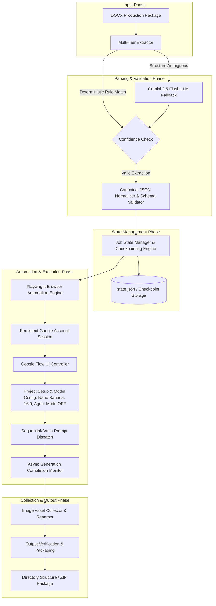

# Google Flow Image Generation Automation — System Documentation

Welcome to the technical architecture and specification documentation for the **Google Flow Image Generation Automation** system.

This documentation suite defines the end-to-end design for an automated pipeline that ingests production packages delivered as Microsoft Word (`.docx`) files, extracts and normalizes image generation prompts, and automates **Google Flow** to produce, collect, and package final image assets.

---

## Document Index

| Document | Description |
| :--- | :--- |
| [**Architecture Overview**](file:///Users/mubeen-dev/Documents/flow-image-generation/docs/architecture.md) | High-level system topology, component responsibilities, data flow, and interfaces. |
| [**Workflow Specification**](file:///Users/mubeen-dev/Documents/flow-image-generation/docs/workflow.md) | Step-by-step execution lifecycle from DOCX ingestion to packaged output. |
| [**Document Extraction Strategy**](file:///Users/mubeen-dev/Documents/flow-image-generation/docs/document-extraction.md) | Multi-tiered extraction architecture designed for unpredictable, LLM-generated DOCX files. |
| [**Canonical JSON Schema**](file:///Users/mubeen-dev/Documents/flow-image-generation/docs/json-schema.md) | JSON Schema definition, field specifications, and concrete data examples. |
| [**Browser Automation Benchmark**](file:///Users/mubeen-dev/Documents/flow-image-generation/docs/browser-automation.md) | Comparative analysis of Playwright, Selenium, Cypress, Puppeteer, and Browser-use. |
| [**Google Flow UI Specification**](file:///Users/mubeen-dev/Documents/flow-image-generation/docs/google-flow.md) | UI interaction mechanics, selector strategies, Agent Mode disabling, and canvas monitoring. |
| [**Authentication & Session Strategy**](file:///Users/mubeen-dev/Documents/flow-image-generation/docs/authentication.md) | Safe session persistence, Google profile management, and human-in-the-loop auth flows. |
| [**LLM Extraction Strategy**](file:///Users/mubeen-dev/Documents/flow-image-generation/docs/llm-strategy.md) | Research on cheap/free LLMs, fallback cascades, and structured output extraction. |
| [**Error Handling & Resumability**](file:///Users/mubeen-dev/Documents/flow-image-generation/docs/error-handling.md) | Failure mode catalog, state state-management, checkpointing, and auto-recovery mechanics. |
| [**Cost & Performance Optimization**](file:///Users/mubeen-dev/Documents/flow-image-generation/docs/cost-optimization.md) | Token optimization, browser resource tuning, and zero-cost operational design. |
| [**Implementation Roadmap**](file:///Users/mubeen-dev/Documents/flow-image-generation/docs/implementation-plan.md) | 12-phase step-by-step development plan with acceptance criteria and risk registers. |

---

## High-Level System Architecture

---

## Core System Principles

1. **Reliability Over Speed**  
   The system prioritizes 100% prompt-to-image mapping accuracy, zero loss of generations, and robust failure recovery over aggressive parallel execution.
2. **Deterministic-First Extraction**  
   Local Python XML/DOCX parsing handles structured documents at $0 cost and 0ms latency. LLMs are strictly reserved as secondary fallbacks when document structures deviate.
3. **Strict Schema Enforcers**  
   No extracted data reaches the browser automation engine without passing validation against the strict JSON Schema.
4. **Resumable State Checkpointing**  
   Every prompt execution updates a persistent state file (`state.json`). If a network interruption or browser crash occurs at prompt #14 of 20, the system resumes seamlessly at prompt #14 without re-generating items #1 through #13.
5. **Compliant Authentication & Human-in-the-Loop Security**  
   The system uses persistent browser profiles and storage states for legitimate Google account access. It never attempts to bypass CAPTCHA, MFA, or anti-bot protections; instead, it pauses and prompts an operator for manual authorization.
6. **Zero-Trust UI Automation**  
   Selectors use resilient ARIA roles, text labels, and DOM mutation observers rather than fragile dynamic CSS class names.
