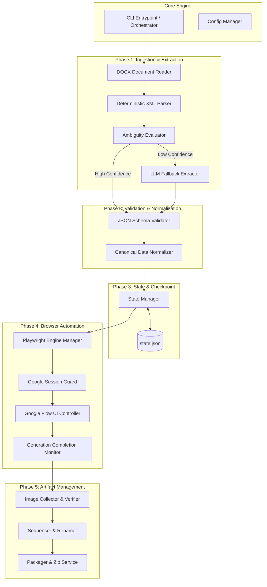
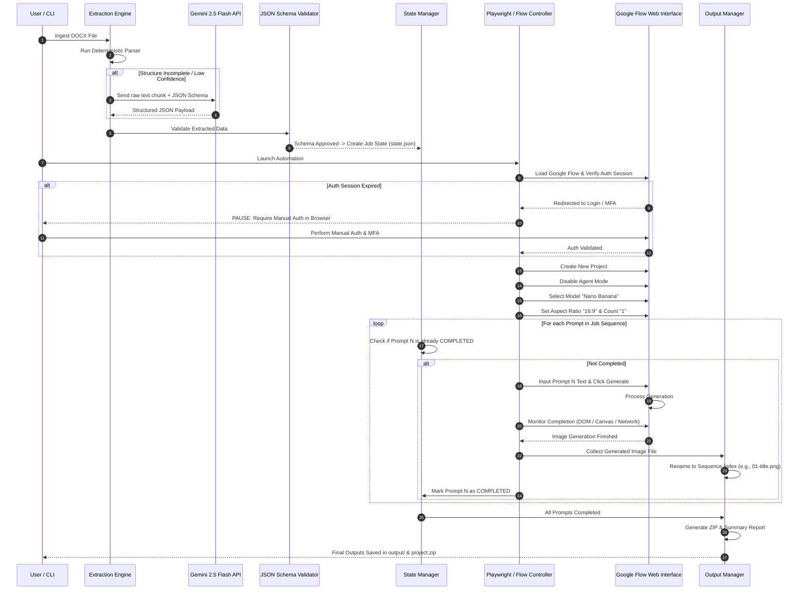

# System Architecture Specification

## 1. System Overview

The **Google Flow Image Generation Automation** system is a modular, resilient pipeline designed to transform unstructured or semi-structured LLM-generated `.docx` production scripts into structured image generation jobs, execute them via Google Flow's browser interface, and manage output artifacts.

The architecture emphasizes **loose coupling**, **resumability**, **strict schema validation**, and **zero-bypass authentication compliance**.

---

## 2. Core Architectural Components



### Component Breakdown

#### 2.1 Orchestrator / CLI Module
- **Purpose**: Controls job execution lifecycle, parses input arguments, initializes configuration, and coordinates component transitions.
- **Responsibilities**:
  - Handles command-line arguments (e.g., input file path, target aspect ratio override, headless mode toggle).
  - Triggers extraction, validation, browser setup, execution loop, and packaging.

#### 2.2 Extraction Engine (`extractor/`)
- **Primary Sub-Component**: `DeterministicParser` — Uses Python's `zipfile` and `xml.etree.ElementTree` or `python-docx` to scan paragraphs, headings, and tables for beat markers (e.g., `BEAT X — 0:12–0:16`), script cues, and prompt blocks.
- **Secondary Sub-Component**: `LLMFallbackExtractor` — Activated only if `DeterministicParser` fails to extract expected prompt fields or returns a confidence score below 0.90. Invokes Gemini 2.5 Flash API with structured JSON output rules.
- **Ambiguity Evaluator**: Measures extracted prompt count against expected script beat counts, checks for missing metadata or empty strings, and decides whether fallback to LLM is required.

#### 2.3 Validation & Normalization (`validator/`)
- **JSON Schema Validator**: Validates the extracted payload against the formal `draft-07` canonical schema (`json-schema.json`).
- **Data Normalizer**: Standardizes aspect ratios (e.g., converting `"16x9"`, `"16 by 9"`, `"wide"` into `"16:9"`), cleans up whitespace, strips markdown artifacts, and assigns sequential index IDs.

#### 2.4 State & Checkpoint Manager (`state/`)
- **State Store**: Writes and reads `state.json` inside the project workspace directory.
- **Job States**:
  - `INITIALIZED`: Document parsed and validated.
  - `IN_PROGRESS`: Browser launched, prompts being processed sequentially.
  - `PROMPT_COMPLETED`: Prompt $N$ successfully generated and image verified.
  - `COMPLETED`: All prompts processed and output packaged.
  - `FAILED`: Critical unrecoverable error logged with context.

#### 2.5 Browser Automation Engine (`automation/`)
- **Engine Manager**: Wraps Playwright (Python/Node.js) context initialization, viewport setup, download handlers, and tracing.
- **Google Session Guard**: Verifies active login state on Google Flow before attempting operations. Triggers interactive manual login prompt if session is invalid.
- **Flow UI Controller**: Manages DOM interactions within Google Flow:
  - Navigates to project workspace.
  - Toggles **Agent Mode OFF**.
  - Selects model **Nano Banana**.
  - Configures **Aspect Ratio** (e.g., 16:9).
  - Sets image count to **1**.
  - Injects prompt text and clicks Generate.
- **Generation Completion Monitor**: Monitors DOM state changes, canvas updates, progress indicators, and network signals to confirm image generation finish or failure.

#### 2.6 Artifact & Package Manager (`output/`)
- **Collector**: Intercepts browser download events or retrieves image assets from temporary download locations.
- **Sequencer & Renamer**: Re-indexes downloaded images according to job sequence numbers (e.g., `01-prompt-description.png`).
- **Zip Service**: Bundles images and execution summary report into an output archive (`project-name.zip`) alongside an uncompressed output folder.

---

## 3. Component Interaction Sequence



---

## 4. Storage & Directory Architecture

The system operates with isolated runtime directories to ensure zero contamination between runs:

```text
flow-image-generation/
├── docs/                      # Architectural & design documentation
├── config/                    # System configuration & default settings
│   └── settings.yaml
├── schemas/                   # JSON schemas for prompt jobs & state
│   └── canonical-job.schema.json
├── profiles/                  # Isolated browser storage state & profile data (git-ignored)
│   └── google-session/
├── input/                     # Incoming DOCX production packages
│   └── Day13_Production_Package.docx
├── jobs/                      # Execution job states & intermediate data
│   └── job_20260909_143000/
│       ├── normalized_job.json
│       └── state.json
└── output/                    # Final image assets and ZIP packages
    └── job_20260909_143000/
        ├── images/
        │   ├── 01-timeline-overview.png
        │   ├── 02-wolf-and-dog-comparison.png
        │   └── ...
        ├── summary.json
        └── job_20260909_143000.zip
```

---

## 5. Security & Isolation Boundaries

1. **Credential Isolation**: No Google passwords or MFA keys are stored in code, environment variables, or repository files. Authentication relies solely on persistent browser profiles.
2. **Local Processing**: DOCX parsing, schema validation, state tracking, and asset packaging occur entirely on the local system.
3. **API Key Security**: LLM fallback API keys (if used) are loaded exclusively via environment variables (`GEMINI_API_KEY`) and strictly git-ignored.
