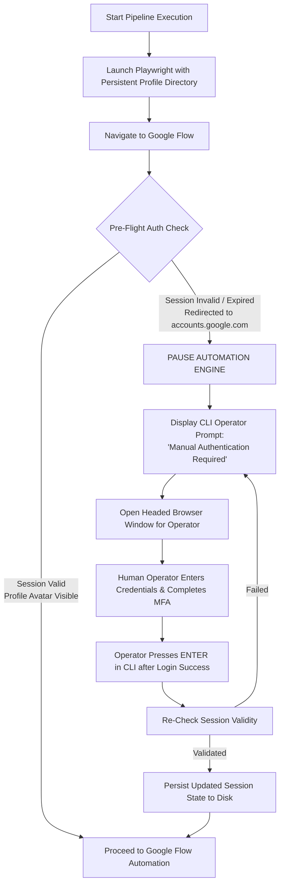

# Google Account Authentication & Session Persistence Strategy

## 1. Safety & Compliance Principles

Google enforces strict automated bot detection, Multi-Factor Authentication (MFA), and CAPTCHA mechanisms on Google accounts.

### Core Compliance Guarantees:
- **No Anti-Bot Bypass**: The system will **never** attempt to bypass, subvert, or solve CAPTCHAs, MFA prompts, or Google security challenges using automated scripts, third-party CAPTCHA solving services, or exploit hooks.
- **Operator-Driven Authentication**: All primary authentication, credential entry, and MFA verifications are performed manually by a human operator in a real browser interface.
- **Persistent State Reuse**: The system relies exclusively on preserving legitimate browser storage states (cookies, session storage, local storage) established during human authorization.

---

## 2. Evaluation of Session Persistence Approaches

| Approach | Description | Viability | Security & Anti-Bot Profile | Recommended? |
| :--- | :--- | :--- | :--- | :--- |
| **Persistent Browser Profile (`userDataDir`)** | Run Playwright against a dedicated Chrome user profile directory on disk. | **Highest** | Appears as a standard returning Chrome user session with full browser cache and TLS fingerprint. | **Yes (Primary)** |
| **Playwright `storageState.json`** | Save and restore cookies and `localStorage` as JSON snapshots. | High | Effective for short sessions; may miss low-level browser tokens. | **Yes (Backup)** |
| **Manual Cookie Injection** | Extract cookies manually and inject via code. | Moderate | Brittle; cookies expire quickly without session storage synchronization. | No |
| **Automated Credential Typing** | Script typing email and password directly into Google login forms. | **Unviable** | Triggers instant Google bot detection, CAPTCHAs, and account flags. | **Prohibited** |
| **Google OAuth 2.0 Tokens** | Use OAuth access tokens. | Unviable | Google Flow web UI does not support external OAuth token injection for web sessions. | N/A |

---

## 3. Recommended Hybrid Session Architecture



---

## 4. Operational Workflow & Session Management

### 4.1 First-Time Setup & Session Initialization

1. **Setup Command**: Operator executes `python main.py --setup-auth`.
2. **Headed Browser Launch**: Pipeline launches Chrome in headed (visible) mode using the dedicated workspace profile directory (`profiles/google-session`).
3. **Operator Login**: Operator navigates to Google Flow, logs into their Google account, completes any required MFA (SMS, Google Prompt, Authenticator), and checks *"Remember this browser"*.
4. **Session Capture**: Once Google Flow workspace is loaded, the operator closes the browser or confirms in CLI. The profile directory now contains all necessary auth cookies, IndexedDB tokens, and local storage state.

### 4.2 Session Lifetime & Pre-Flight Verification

Before submitting any image generation prompts, the pipeline runs a **Pre-Flight Session Check**:
- Navigates to `https://labs.google/flow`.
- Evaluates DOM for presence of logged-in user indicators (e.g., user profile avatar, workspace project list).
- If authenticated: proceeds directly with headless execution.
- If unauthenticated: triggers Session Expiration Protocol.

### 4.3 Session Expiration Protocol

If a session expires during a long-running batch job (e.g., after 24–48 hours or due to Google security re-validation):

1. **Immediate Pause**: The pipeline halts prompt submission immediately.
2. **State Preservation**: Saves current progress to `state.json` (marking completed prompts as `COMPLETED`).
3. **Alert Notification**: Emits an audible console chime and prints a high-visibility terminal alert:
   ```text
   ======================================================================
   [ACTION REQUIRED] Google session has expired or re-authentication is required.
   The pipeline has paused execution to protect job state.
   
   1. The browser window has been brought to the foreground.
   2. Please complete Google authentication/MFA in the open window.
   3. Once logged in and on the Google Flow dashboard, press ENTER here to resume.
   ======================================================================
   ```
4. **Resumption**: Upon operator confirmation, the pre-flight check runs. Once verified, job execution resumes automatically from prompt $N$ without re-generating completed items.

---

## 5. Security & Isolation Safeguards

1. **Git Isolation**: The `profiles/` directory contains sensitive session cookies and tokens. It must be explicitly included in `.gitignore`:
   ```text
   # .gitignore
   profiles/
   *.storage.json
   ```
2. **Environment Isolation**: No passwords or MFA secrets are stored in configuration files or code repository.
3. **Directory Permissions**: On Linux/macOS, profile directories are restricted to user-only read/write access (`chmod 700 profiles/google-session`).
