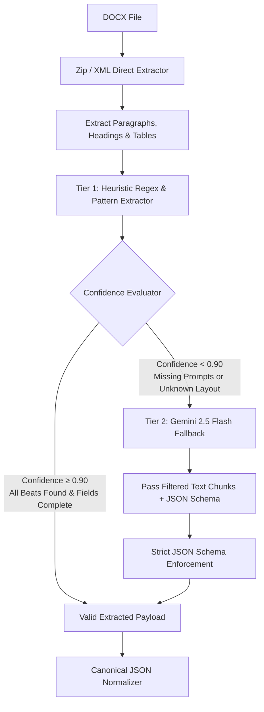

# Document Extraction Strategy Specification

## 1. Context & Challenge

The input documents for this pipeline (e.g., `Day13_Production_Package.docx`) are generated by Large Language Models. Consequently, **document structures are inherently variable**.

Future production packages may feature:
- Altered section numbers, names, or heading hierarchies (e.g., `"Section 5: Image Prompts"` vs `"Visual Prompts"` vs `"Beat Prompts"`).
- Different ordering of visual rules, scripts, and prompt blocks.
- Embedded tables vs raw paragraph lists vs structured bullet points.
- Extraneous commentary, change notes, or channel metadata.
- Variations in prompt block formatting (e.g., key-value pairs vs inline descriptors).

A rigid parsing strategy assuming exact paragraph indices or static heading titles will inevitably break. This document outlines a robust, multi-tiered extraction strategy capable of handling structural drift while minimizing API costs and latency.

---

## 2. Real-World Document Analysis (`Day13_Production_Package.docx`)

Analysis of sample production packages reveals the following key structural elements:

1. **Beat Header Markers**: Formatted as `BEAT <number> — <timestamp>` (e.g., `BEAT 4 — 0:12–0:16`).
2. **Script Cues**: Preceded by `Script:` (e.g., `Script: “Which is nothing at all. A blink...”`).
3. **Primary Prompt Blocks**: Detailed visual descriptions describing hand-drawn 2D cartoon styles, color fills, background elements, line weights, aspect ratios, and resolution specs (`16:9, 1920×1080`).
4. **Metadata Blocks**: Key-value pairs following the primary prompt block:
   - `Camera:`
   - `Lighting:`
   - `Mood:`
   - `Action:`
   - `Palette:`
5. **Cross-Reference Beat Tables**: Tables mapping beat indices to timing, shot type, motion rules, and checkboxes.

---

## 3. Evaluation of Extraction Options

| Dimension | Option A: Deterministic Parsing | Option B: Hybrid Extraction (Recommended) | Option C: LLM-Only Extraction | Option D: RAG / Schema-Guided |
| :--- | :--- | :--- | :--- | :--- |
| **Primary Mechanism** | Python XML / `python-docx` regex & AST rules | Deterministic primary + Confidence score + Cheap LLM fallback | Dump document text into LLM prompt | Chunk text, vector search, pass top chunks to LLM |
| **API Cost** | $0.00 | $0.00 (95%+ runs) / Micro-cents on fallback | $0.05–$0.20 per document | $0.02–$0.10 per document |
| **Latency** | 10–50 ms | 10–50 ms (Normal) / 1–2 sec (Fallback) | 3–10 seconds | 2–5 seconds |
| **Hallucination Risk**| Zero | Zero (Deterministic) / Near-zero (Constrained LLM schema) | Moderate (LLM may invent missing prompts) | Low-Moderate |
| **Structural Drift Tolerance** | Low-Moderate | High | Very High | High |
| **Maintenance Cost** | Low | Low-Medium | Low | High (Vector store overhead) |

---

## 4. Recommended Multi-Tier Extraction Architecture



---

## 5. Tier 1: Deterministic Heuristic Extraction Rules

The Tier 1 Extractor parses the DOCX file without invoking external LLM APIs. It uses pattern recognition anchored to conceptual invariants rather than rigid layout positions.

### 5.1 Pattern Recognition Heuristics

1. **Beat Boundary Detection**:
   - Matches regex: `r'BEAT\s+(\d+)\s*[—\-–]\s*(\d+:\d+[–\-—]\d+:\d+)'` (case-insensitive).
   - Identifies sequence number $N$ and timing interval.

2. **Script Line Extraction**:
   - Matches paragraphs starting with `Script:` or enclosed in quotation marks following a beat header.

3. **Prompt Block Boundary Detection**:
   - Identifies paragraphs following script lines that contain visual style descriptions (e.g., keywords: `illustration`, `background`, `cartoon`, `aspect ratio`, `16:9`, `camera`).
   - Merges contiguous prompt lines until the next metadata block or beat boundary.

4. **Metadata Extraction**:
   - Key-value parsing for lines matching:
     - `Camera:\s*(.+)`
     - `Lighting:\s*(.+)`
     - `Mood:\s*(.+)`
     - `Action:\s*(.+)`
     - `Palette:\s*(.+)`

---

## 6. Tier 2: LLM-Assisted Fallback Extraction

When Tier 1 fails to find all expected beats or encounters structural anomalies, the pipeline engages the **Tier 2 Fallback Extractor**.

### 6.1 Text Filtering Strategy (Token Minimization)
To minimize token usage and cost:
- The parser filters out non-essential sections (e.g., Section 1 Verification Gate, Section 2 Full Script, Section 6 Motion Specs) by scanning for paragraph chunks near prompt keywords.
- Only the candidate prompt text (typically Section 5 or equivalent prompt lists) is passed to the LLM.

### 6.2 Structured Prompting Template
The LLM is invoked using strict JSON schema output mode (`response_mime_type="application/json"` in Gemini 2.5 Flash):

```text
You are a precision document extraction engine.
Extract all image generation prompts from the provided text into the exact JSON schema provided.

Rules:
1. Do not invent or summarize prompts. Extract prompt text verbatim.
2. Each beat must have a sequence number, prompt text, script cue, and metadata.
3. Standardize aspect ratio to "16:9" unless explicitly specified otherwise.

Document Text:
<<<
{FILTERED_TEXT_CHUNK}
>>>
```

---

## 7. Confidence & Ambiguity Scoring Algorithm

The `ConfidenceEvaluator` calculates a composite score $S \in [0.0, 1.0]$ based on four criteria:

$$S = 0.40 \cdot C_{\text{sequence}} + 0.30 \cdot C_{\text{completeness}} + 0.20 \cdot C_{\text{non\_empty}} + 0.10 \cdot C_{\text{metadata}}$$

Where:
- $C_{\text{sequence}} = 1.0$ if extracted sequence numbers form a continuous sequence $1, 2, \dots, N$ without missing indices; $0.0$ otherwise.
- $C_{\text{completeness}} = \frac{\text{Extracted Prompts}}{\text{Expected Beat Count}}$ (from script header/tables).
- $C_{\text{non\_empty}} = 1.0$ if all prompt text strings exceed 30 characters; $0.0$ otherwise.
- $C_{\text{metadata}} = \frac{\text{Prompts with Camera \& Mood Specs}}{\text{Total Extracted Prompts}}$.

- **Decision Rule**:
  - If $S \ge 0.90$: Accept Tier 1 extraction.
  - If $S < 0.90$: Route to Tier 2 LLM fallback.
