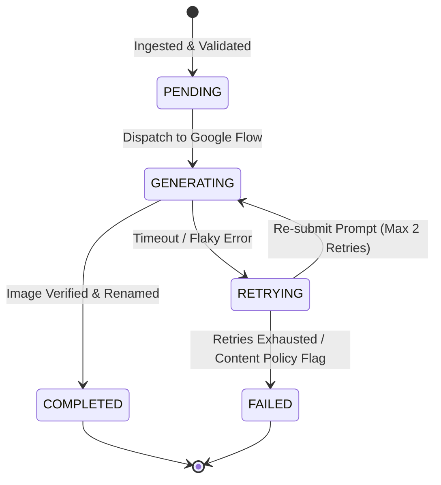

# Error Handling, State Management & Resumability Architecture

## 1. Overview

The **Google Flow Image Generation Automation** system is built on a zero-data-loss principle. If a long-running batch job (e.g., 120 images) encounters a network drop, browser crash, or session timeout at prompt #87, **the system must resume from prompt #87 without re-generating prompts #1 through #86**.

This document outlines the state architecture, checkpointing mechanics, error taxonomy, and recovery procedures.

---

## 2. State & Checkpoint Architecture

### 2.1 State Schema (`state.json`)

Every job creates and maintains an active `state.json` file inside `jobs/job_<timestamp>/`. The state file records the execution progress of every prompt in real-time.

```json
{
  "job_id": "job_20260909_143000",
  "project_name": "Wild Minds - Day 13 Reset",
  "total_prompts": 120,
  "status": "IN_PROGRESS",
  "started_at": "2026-09-09T14:30:00Z",
  "updated_at": "2026-09-09T14:42:15Z",
  "current_sequence": 14,
  "summary": {
    "completed": 13,
    "failed": 0,
    "pending": 107
  },
  "prompts": [
    {
      "sequence": 1,
      "status": "COMPLETED",
      "attempts": 1,
      "prompt_text": "Hand-drawn 2D cartoon...",
      "output_filename": "01-timeline-overview.png",
      "completed_at": "2026-09-09T14:31:05Z",
      "error": null
    },
    {
      "sequence": 14,
      "status": "GENERATING",
      "attempts": 2,
      "prompt_text": "Hand-drawn 2D cartoon...",
      "output_filename": null,
      "completed_at": null,
      "error": "Timeout waiting for generation completion (Attempt 1)"
    }
  ]
}
```

### 2.2 Lifecycle State Transitions



---

## 3. Comprehensive Error Taxonomy & Recovery Catalog

### 3.1 Category A: Authentication & Session Errors

| Error Code | Trigger Condition | System Behavior | Recovery Procedure |
| :--- | :--- | :--- | :--- |
| `AUTH_EXPIRED` | Pre-flight check detects redirect to `accounts.google.com`. | **PAUSE PIPELINE**. Save `state.json`. Play sound chime. | Display CLI alert -> Open headed browser -> Wait for operator to complete manual login & MFA -> Resume upon ENTER. |
| `AUTH_CAPTCHA` | Google presents a CAPTCHA challenge during session navigation. | **PAUSE PIPELINE**. Do NOT attempt automated solving. | Notify operator via CLI -> Operator manually solves CAPTCHA in open browser window -> Resume execution. |
| `AUTH_DENIED` | Account permissions revoked or Google Workspace access restricted. | **HALT PIPELINE**. Mark job status as `FAILED`. | Log fatal error -> Alert operator to inspect account status. |

---

### 3.2 Category B: Google Flow UI & Automation Errors

| Error Code | Trigger Condition | System Behavior | Recovery Procedure |
| :--- | :--- | :--- | :--- |
| `FLOW_LOAD_TIMEOUT` | Google Flow URL fails to render within 30 seconds. | Retry page load up to 3 times with exponential backoff. | Refresh browser page -> Re-verify DOM readiness. |
| `PROJECT_CREATE_FAIL`| "New Project" button click fails to spawn workspace. | Re-navigate to main dashboard. | Attempt alternative URL entrypoint -> Re-try project creation. |
| `AGENT_MODE_STUCK` | Toggle fails to transition to `OFF` state. | Dispatch direct JavaScript click event to toggle input element. | Re-evaluate `aria-checked` -> If still ON, raise configuration exception. |
| `GEN_BUTTON_DISABLED`| Prompt input field filled but Generate button remains disabled. | Dispatch `input` and `change` DOM events to trigger web component binding. | Re-focus textarea -> Re-type prompt with simulated keystrokes. |
| `GEN_TIMEOUT` | Generation exceeds 90 seconds without completion signal. | Cancel generation (click stop/refresh) -> Increment attempt counter. | If `attempts < 3`: Re-submit prompt. If `attempts >= 3`: Mark prompt `FAILED` & move to next. |
| `CONTENT_POLICY_FLAG`| Red toast alert: "Prompt violates content guidelines". | Intercept toast text -> Mark prompt `FAILED` immediately without retrying. | Record policy error in `state.json` -> Log prompt text -> Continue to next prompt sequence. |

---

### 3.3 Category C: Document Extraction Errors

| Error Code | Trigger Condition | System Behavior | Recovery Procedure |
| :--- | :--- | :--- | :--- |
| `DOCX_CORRUPT` | Zip extraction or XML parsing fails. | Halt pipeline immediately. | Display user error: "Invalid or corrupted DOCX file provided." |
| `EXTRACTION_LOW_CONF`| Tier 1 parser confidence score $< 0.90$. | Trigger Tier 2 Gemini 2.5 Flash LLM Fallback parser. | Pass filtered text chunks -> Re-parse -> Validate against JSON schema. |
| `SCHEMA_INVALID` | Extracted JSON fails schema validation. | Print detailed JSON Schema validation error paths. | Save `raw_extraction.json` for debugging -> Halt pipeline. |

---

### 3.4 Category D: Output & Asset Collection Errors

| Error Code | Trigger Condition | System Behavior | Recovery Procedure |
| :--- | :--- | :--- | :--- |
| `DOWNLOAD_INTERRUPT` | File download fails or yields 0-byte file. | Fallback to direct DOM image element source extraction (`src` blob/url). | Fetch image bytes directly via Playwright HTTP context -> Verify header. |
| `IMAGE_CORRUPT` | Downloaded file fails PNG header verification. | Delete corrupted file -> Re-trigger image download. | Re-attempt download -> Log asset warning if unresolved. |
| `ZIP_BUILD_FAIL` | Archiving output folder fails due to file lock. | Wait 1000ms -> Re-attempt zip compression. | Retry compression -> Retain uncompressed output directory as safe fallback. |

---

### 3.5 Category E: Browser Crash & Infrastructure Errors

| Error Code | Trigger Condition | System Behavior | Recovery Procedure |
| :--- | :--- | :--- | :--- |
| `BROWSER_CRASH` | Playwright browser process crashes or disconnects. | Catch process exit signal -> Save state checkpoint. | Re-launch Playwright browser -> Re-open Google Flow -> Locate active project -> Resume at prompt $N$. |
| `NETWORK_DISCONNECT` | Host machine loses internet connectivity. | Pause execution loop -> Poll network ping every 10 seconds. | Re-establish connection -> Refresh Flow page -> Resume execution from checkpoint. |

---

## 4. Automatic Checkpoint & Resume Execution Algorithm

When launching the pipeline for a given job:

```python
def execute_job(docx_path: str, resume: bool = True):
    job_id = compute_job_id(docx_path)
    state_file = f"jobs/{job_id}/state.json"

    # 1. Load or Initialize State
    if resume and os.path.exists(state_file):
        logger.info(f"Existing job state found. Resuming {job_id}...")
        state = StateManager.load(state_file)
    else:
        logger.info(f"Initializing new job state for {job_id}...")
        normalized_job = extract_and_validate(docx_path)
        state = StateManager.create(normalized_job)

    # 2. Iterate Prompts with Checkpoint Skipping
    for prompt_spec in state.prompts:
        if prompt_spec.status == "COMPLETED":
            logger.info(f"Prompt #{prompt_spec.sequence} already COMPLETED. Skipping.")
            continue

        # Process Prompt
        success = flow_controller.generate_image(prompt_spec)
        if success:
            state.mark_completed(prompt_spec.sequence)
        else:
            state.mark_failed(prompt_spec.sequence)
        
        # Immediate State Flush to Disk
        state.save()
```
