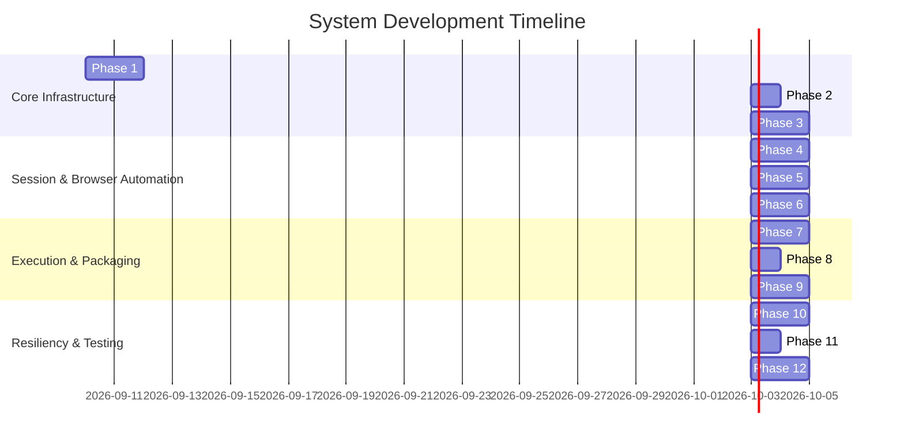

# Phased Implementation Plan & Development Roadmap

## 1. Overview

This document defines the 12-phase implementation roadmap for building the **Google Flow Image Generation Automation** system. Each phase represents a self-contained module with defined inputs, outputs, acceptance criteria, and risk mitigations.

---

## 2. 12-Phase Phased Roadmap

---

## 3. Phase Specifications

### Phase 1: Local DOCX Deterministic Parser Engine
- **Objective**: Implement zero-cost, high-speed Python parser for `.docx` files using `xml.etree.ElementTree` / `python-docx`.
- **Inputs**: Incoming `.docx` production package path.
- **Outputs**: Dictionary containing raw extracted prompt blocks, script lines, beat sequence numbers, and metadata.
- **Dependencies**: None.
- **Acceptance Criteria**: Successfully parses 120 beats from `Day13_Production_Package.docx` in under 100ms with 100% beat index accuracy.
- **Risks & Mitigation**: Structural heading changes. *Mitigation*: Anchor regex to pattern invariants (`BEAT \d+`, `Script:`).

---

### Phase 2: Canonical JSON Schema & Validation Suite
- **Objective**: Implement strict JSON Schema validation (`jsonschema` library) and data normalization engine.
- **Inputs**: Extracted raw dictionary from Phase 1.
- **Outputs**: Validated, normalized `normalized_job.json` matching `json-schema.json`.
- **Dependencies**: Phase 1.
- **Acceptance Criteria**: Schema validator rejects invalid aspect ratios or missing prompts; normalizes sequence indices.

---

### Phase 3: LLM Fallback Extractor & Confidence Evaluator
- **Objective**: Integrate Gemini 2.5 Flash API fallback parser and confidence scoring evaluator.
- **Inputs**: DOCX text chunks when Tier 1 parser confidence score $< 0.90$.
- **Outputs**: Validated canonical JSON payload generated by Gemini API.
- **Dependencies**: Phase 2.
- **Acceptance Criteria**: Correctly extracts prompts from an intentionally altered DOCX file with missing section headings using Gemini AI Studio free tier.

---

### Phase 4: Google Auth & Session Guard Manager
- **Objective**: Implement persistent browser profile manager and human-in-the-loop auth checker.
- **Inputs**: Browser profile path (`profiles/google-session`).
- **Outputs**: Active, authenticated Playwright browser context.
- **Dependencies**: Playwright installation.
- **Acceptance Criteria**: Detects valid session on `labs.google/flow`; pauses and alerts CLI operator if session is expired.

---

### Phase 5: Playwright Google Flow UI Controller
- **Objective**: Automate project creation, Agent Mode toggle (`OFF`), model selection (`Nano Banana`), aspect ratio (`16:9`), and image count (`1`).
- **Inputs**: Authenticated browser context & project spec.
- **Outputs**: Configured Google Flow project workspace ready for prompt submission.
- **Dependencies**: Phase 4.
- **Acceptance Criteria**: Consistently sets Agent Mode to OFF and selects Nano Banana across 10 consecutive test runs.

---

### Phase 6: Single-Image Generation Core
- **Objective**: Implement single prompt injection, Generate button click, and triple-verification async completion monitoring.
- **Inputs**: Single prompt text item.
- **Outputs**: Generated image file downloaded to temporary directory.
- **Dependencies**: Phase 5.
- **Acceptance Criteria**: Submits 1 prompt, detects generation completion reliably within 60s, and verifies non-empty image file.

---

### Phase 7: Multi-Prompt Batch Execution Loop
- **Objective**: Build loop orchestrator to submit 10–120 prompts sequentially in a single workspace session.
- **Inputs**: Complete list of normalized prompts.
- **Outputs**: Sequence of downloaded raw image files.
- **Dependencies**: Phase 6.
- **Acceptance Criteria**: Successfully runs 20 consecutive prompts without losing prompt-to-image sequence alignment.

---

### Phase 8: Output Renamer, Verification & Zip Packager
- **Objective**: Verify image file integrity, rename according to sequence index (`01-title.png`), and bundle output ZIP.
- **Inputs**: Raw downloaded image files + job metadata.
- **Outputs**: Formatted `output/images/` directory and `project_name.zip` archive.
- **Dependencies**: Phase 7.
- **Acceptance Criteria**: Produces valid ZIP file containing all 120 correctly named PNG images.

---

### Phase 9: Resumable State Checkpoint Engine
- **Objective**: Implement real-time `state.json` updates and auto-resume logic.
- **Inputs**: Active job execution state.
- **Outputs**: Persistent `state.json` file flushed after every prompt completion.
- **Dependencies**: Phase 7.
- **Acceptance Criteria**: Intentionally killing browser at prompt #15 and restarting pipeline resumes cleanly at prompt #15.

---

### Phase 10: Error Recovery & Alerting Subsystem
- **Objective**: Implement automatic retries, content policy error handling, network reconnect loops, and sound alerts.
- **Inputs**: Exception signals during browser execution.
- **Outputs**: Logged error records in `state.json` and operator CLI alerts.
- **Dependencies**: Phase 9.
- **Acceptance Criteria**: Handles simulated network drops and content policy flags without pipeline crash.

---

### Phase 11: Performance & Resource Tuning
- **Objective**: Enable headless execution, optimize network request interception, and minimize CPU/RAM usage.
- **Inputs**: Configured automation pipeline.
- **Outputs**: Tuned execution profile.
- **Dependencies**: Phase 10.
- **Acceptance Criteria**: Pipeline runs headlessly with under 500 MB RAM consumption.

---

### Phase 12: End-to-End Integration Testing
- **Objective**: Validate complete pipeline against real production packages (`Day13_Production_Package.docx`).
- **Inputs**: Real DOCX files.
- **Outputs**: Final verified image packages + comprehensive execution logs.
- **Dependencies**: Phases 1–11.
- **Acceptance Criteria**: End-to-end automated run processes complete DOCX package to ZIP with 100% success rate.
