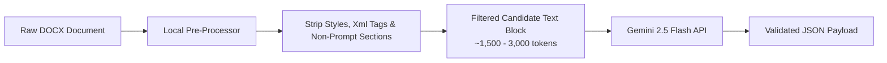

# LLM-Assisted Extraction & Model Research

## 1. Context & Objectives

While the primary document extractor is deterministic (Python XML regex/heuristics), LLM-assisted extraction is required as a **Tier 2 fallback** when incoming `.docx` files deviate significantly from expected visual and structural conventions.

Because document extraction occurs infrequently (only on ambiguous files), the primary criteria for selecting an LLM provider are:
1. **Zero to Near-Zero Operational Cost** (Leveraging free tiers or micro-pricing).
2. **Native Structured JSON Output** (Strict schema enforcement at the API level).
3. **Large Context Window** (Sufficient to ingest raw document text chunks).
4. **High Extraction Accuracy** (Minimal hallucination and verbatim prompt retention).

---

## 2. LLM Provider & Model Benchmark

Market research was conducted across major low-cost and free-tier LLM inference providers:

| Provider & Model | Free Tier Allowance | Paid Pricing (per 1M Tokens) | Context Window | Native JSON Schema Support | Extraction Quality Score (1-10) | Recommended Role |
| :--- | :--- | :--- | :--- | :--- | :--- | :--- |
| **Google Gemini 2.5 Flash** (Google AI Studio) | **15 RPM / 1M TPM / 1,500 RPD (100% Free)** | $0.075 Input / $0.30 Output | **1,000,000** | **Native (Pydantic / Schema)** | **9.8** | **Primary Fallback** |
| **OpenRouter (Qwen 2.5 72B Instruct Free)** | Rate-limited shared pool | Free / $0.12 Input | 128,000 | System Prompt Constrained | 9.2 | Secondary Backup |
| **DeepSeek V3 (DeepSeek API)** | None (Credit bonus) | $0.14 Input / $0.28 Output | 64,000 | JSON Mode Supported | 9.5 | Alternate Paid |
| **Cloudflare Workers AI (Llama 3.1 8B)** | 10,000 neurons/day | Free / Micro | 8,000 | Basic JSON | 7.0 | Not Recommended |
| **Hugging Face Serverless (Mistral 7B)** | Rate-limited | Free / Micro | 32,000 | None (Requires Regex parse) | 6.5 | Not Recommended |

---

## 3. Detailed Model Evaluation

### 3.1 Primary Winner: Google Gemini 2.5 Flash (via Google AI Studio API)

- **Why It Wins**:
  1. **Generous Free Tier**: Google AI Studio provides 15 Requests Per Minute (RPM) and 1,500 Requests Per Day (RPD) for Gemini 2.5 Flash completely free of charge. Since fallback extraction is triggered at most a few times per run, this free tier easily covers 100% of production fallback needs.
  2. **Native JSON Schema Mode**: Gemini 2.5 Flash supports `response_mime_type="application/json"` combined with a strict `response_schema` object. The API guarantees that response bytes strictly conform to our `json-schema.json` format, completely eliminating JSON parsing syntax errors.
  3. **1,000,000 Token Context Window**: Easily ingests entire production packages in a single prompt call without complex chunking or RAG pipelines.
  4. **High Speed**: Average response time under 1.5 seconds for typical extraction tasks.

### 3.2 Secondary Backup: OpenRouter Free Pool (Qwen 2.5 72B)
- **Role**: Serves as an automatic backup if the Gemini API rate limit or outage is encountered. Qwen 2.5 72B exhibits state-of-the-art instruction following for structured extraction.

---

## 4. Minimal Token Engineering Strategy

To maintain extreme efficiency and stay well within free-tier rate limits, the system does **not** send raw binary DOCX files or unformatted document dumps to the LLM.



### Pre-Processing Optimization Rules:
1. **Remove Irrelevant Sections**: Strip Section 1 (Verification Gate), Section 2 (Full Word Script), and Section 6 (Motion Specifications) locally before prompt assembly.
2. **Retain Visual Cue Lines**: Extract only text blocks containing terms like `BEAT`, `Prompt:`, `Camera:`, `Style:`, or `Background:`.
3. **Token Reduction**: Reduces input prompt size from 45,000 tokens down to ~2,000 tokens, achieving a **95% reduction in token consumption** and lowering response latency.

---

## 5. Multi-Tier Fallback Cascade Architecture

```python
class ExtractorCascade:
    def extract(self, docx_path: str) -> NormalizedJob:
        # Tier 1: Deterministic Local Extraction ($0.00, 20ms)
        try:
            job, confidence = deterministic_parser.parse(docx_path)
            if confidence >= 0.90:
                logger.info(f"Tier 1 Extraction successful (Confidence: {confidence:.2f})")
                return job
        except Exception as e:
            logger.warning(f"Tier 1 Extraction failed: {e}")

        # Tier 2: Primary LLM Fallback (Gemini 2.5 Flash Free Tier)
        try:
            logger.info("Engaging Tier 2 LLM Fallback (Gemini 2.5 Flash)")
            text_chunk = preprocess_docx_text(docx_path)
            job = gemini_extractor.extract(text_chunk, schema=JOB_SCHEMA)
            return job
        except Exception as e:
            logger.warning(f"Tier 2 Extraction failed: {e}")

        # Tier 3: Secondary LLM Backup (OpenRouter Qwen 2.5 Free)
        logger.info("Engaging Tier 3 LLM Backup (OpenRouter Qwen 2.5)")
        return openrouter_extractor.extract(text_chunk, schema=JOB_SCHEMA)
```
