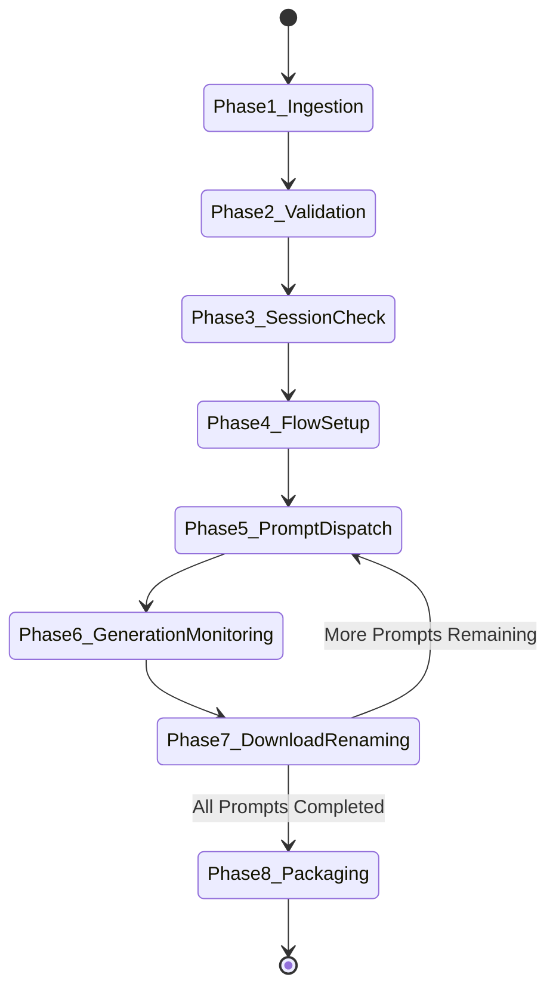

# End-to-End Workflow Specification

## 1. Overview

This document specifies the operational lifecycle of a production run in the **Google Flow Image Generation Automation** system. Every step is designed to be deterministic, recoverable, observable, and fully logged.

---

## 2. Phase-by-Phase Execution Lifecycle

---

### Phase 1: Ingestion & Extraction

1. **Trigger**: User provides a target `.docx` file (e.g., `input/Day13_Production_Package.docx`).
2. **File Check**: Verify file existence, read permissions, zip integrity, and XML structure.
3. **Deterministic Parse**:
   - Extract raw text and tables using Python XML parsing.
   - Scan for Section 5 ("Image Prompts") or beat markers (`BEAT 1`, `BEAT 2`, etc.).
   - Extract prompt text blocks, scripts, and key-value metadata (`Camera:`, `Lighting:`, `Mood:`, `Action:`, `Palette:`).
4. **Ambiguity & Confidence Scoring**:
   - Evaluate extracted prompt count against total script beats.
   - If confidence $\ge 0.90$, proceed directly to Phase 2.
   - If confidence $< 0.90$ (missing fields, unexpected headers, or malformed sections), route text chunks to the **Gemini 2.5 Flash API** fallback parser.

---

### Phase 2: Schema Normalization & Schema Validation

1. **Normalizer Execution**:
   - Assign sequential index numbers (`1, 2, 3, ... N`).
   - Clean prompt text (strip duplicate spaces, normalize quotes, standardize resolution strings).
   - Standardize default aspect ratio to `"16:9"` if unspecified.
   - Set model parameter to `"nano_banana"`.
   - Set generation count parameter to `1`.
2. **Schema Validation**:
   - Validate standardized JSON against `canonical-job.schema.json`.
   - If schema validation fails, raise an unrecoverable validation error, save error report, and halt pipeline.
3. **Job Initialization**:
   - Create job workspace directory (`jobs/job_<timestamp>/`).
   - Write `normalized_job.json` and initialize `state.json`.

---

### Phase 3: Session Initialization & Auth Check

1. **Browser Launch**:
   - Launch Playwright using the dedicated persistent browser profile directory (`profiles/google-session`).
2. **Navigation & Session Audit**:
   - Navigate to Google Flow URL (`https://labs.google/flow` or workspace entrypoint).
   - Check DOM for authenticated user indicators (e.g., profile avatar, project workspace button).
3. **Auth Rejection Handler**:
   - If redirected to `accounts.google.com` or login modal detected:
     - Pause automation execution.
     - Display high-visibility CLI alert: `[ACTION REQUIRED] Google session expired. Please log in manually in the opened browser window.`
     - Wait for user interaction (timeout: 300 seconds).
     - Re-audit session state upon user confirmation.

---

### Phase 4: Google Flow UI Initialization

Once authenticated, the automation configures the project canvas:

1. **Create/Open Project**:
   - Click **"New Project"** button.
   - Assign project title matching input document (e.g., `Wild Minds - Day 13 Reset`).
2. **Disable Agent Mode**:
   - Locate the **Agent Mode** toggle switch in the UI.
   - Audit toggle state; if `Active/ON`, click toggle to set to **`OFF`**.
   - *Rationale*: Direct prompt execution requires predictable, un-agentic single-prompt processing.
3. **Configure Model**:
   - Open model selector dropdown.
   - Select **"Nano Banana"** (or Nano Banana Pro, based on job spec).
4. **Set Aspect Ratio & Output Parameters**:
   - Open aspect ratio selector.
   - Select target ratio (e.g., **`16:9`**).
   - Verify image generation count is set to exactly **`1`**.

---

### Phase 5: Prompt Dispatch Loop

For each item $i$ in `normalized_job.json`:

1. **Checkpoint Check**:
   - Inspect `state.json`. If `prompts[i].status == "COMPLETED"`, skip item $i$ and proceed to item $i+1$.
2. **Input Injection**:
   - Clear prompt input textarea.
   - Type prompt text $i$ into input field (using simulated keystrokes or direct value injection with event dispatching to prevent UI input truncation).
3. **Submission**:
   - Verify Generate button is enabled.
   - Click **"Generate"** button.
   - Update `state.json`: set `prompts[i].status = "GENERATING"`, log timestamp.

---

### Phase 6: Async Generation Completion Monitoring

1. **Polling Strategy**:
   - Monitor DOM for generation completion indicators:
     - Spinner/progress bar removal on target prompt card.
     - Generation completion status badge (`aria-label="Generation complete"`).
     - Rendering of final image canvas element.
2. **Timeout & Failure Guards**:
   - Maximum generation timeout: **90 seconds** per image.
   - If timeout expires or error toast appears (e.g., *"Prompt failed content policy"* or *"Model busy"*):
     - Log failure reason in `state.json`.
     - Attempt retry (up to 2 retries per prompt).
     - If all retries fail, mark prompt $i$ as `FAILED` and record failure metadata without crashing the entire run.

---

### Phase 7: Download, Verification & Renaming

1. **Asset Interception**:
   - Intercept browser download event or locate generated image URL/blob in DOM.
   - Trigger download to temporary workspace directory.
2. **Image Integrity Verification**:
   - Confirm file exists and size $> 20\text{ KB}$.
   - Verify valid image header (PNG or JPEG magic bytes).
3. **Sequential Renaming**:
   - Format sequence number with leading zeros based on total count (e.g., `01`, `02`, ... `120`).
   - Standardized output name format: `<sequence_number>-<slugified_title_or_beat>.png`
   - Example: `01-beat-1-timeline-overview.png`
4. **State Persistence**:
   - Move verified file to `output/job_<timestamp>/images/`.
   - Update `state.json`: set `prompts[i].status = "COMPLETED"`, record output path, commit write to disk.

---

### Phase 8: Output Packaging & Summary Generation

1. **Completion Check**:
   - Verify all prompts are processed (`COMPLETED` or explicitly marked `FAILED`).
2. **Summary Report**:
   - Generate `summary.json` containing total run time, success count, failure count, and asset manifest.
3. **Archive Creation**:
   - Compress `output/job_<timestamp>/images/` and `summary.json` into `output/job_<timestamp>.zip`.
4. **CLI Notification**:
   - Print execution summary report to console.
